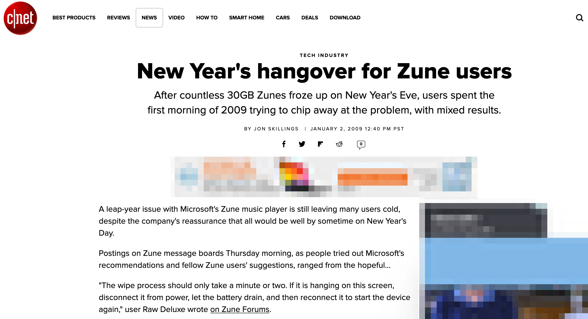

= #RetourAuxSources : Ne perdez plus votre Temps avec les Dates
Frédéric Camblor
:author-twitter: @fcamblor
:author-avatar: img/fcamblor-avatar.jpg
:author-company: 4SH France
:author-company-logo: img/4sh_logo.svg
:hashtags: #DateTimeBasics
:event: Workshop 4SH
:date: 13 février 2019
:city: Bordeaux

[slide=poster]
Intro

[.time]#00:00:00#

[WARNING, caption=Avertissement]
Cette présentation n'aborde pas vraiment des technologies à la mode. +
Pire, vous risquez de ressortir de cette présentation avec moins
de certitudes que vous n'en aviez en arrivant.
[.question]#Acceptez-vous de poursuivre la présentation ?#
_Si vous voulez savoir comment déployer dans la blockchain des
microservices Kotlin avec Kubernetes, il est encore temps de
rentrer chez vous…_

[slide=poster]
Bonjour à tous

[.time]#00:02:00#
Bonjour à *toutes* et à tous !
Je m'appelle Frédéric Camblor.
Je suis développeur Web chez #4SH#, une ESN cool de Bordeaux.

.4SH
image::img/4sh-people.gif[author="4SH", role="4SH people"]

[.question]#Qui connaît 4SH ?#
Chez 4SH on fait du développement **WEB & Mobile**. +
Depuis l'origine, on a un ADN très technique et généralement on est
maître des stacks qu'on utilise (voire il nous arrive de les développer nous-même). +
Un truc que j'aime bien, c'est qu'on a des graphistes qui s'occupent
de faire de jolies applications, bien plus que ce que je serais capable
de faire :-). Et rien que le fait de plus avoir à faire du CSS ... moi perso j'adore ca.

[slide=blank]
Enchaînement vers l'introduction

[.time]#00:04:00#

Aujourd'hui, j'ai envie de vous parler d'un sujet sur lequel je me suis
souvent cassé les dents : les Dates et le Temps. +
Depuis plusieurs années maintenant, je tiens un backlog des différents
problèmes que j'ai pu rencontrer : ce talk est l'occasion de vous les partager.

[slide=question]
Qui n'a jamais eu de soucis avec le Temps ici ?

#Il ne faut pas avoir honte de s'être cassé les dents dessus.. c'est arrivé aux meilleurs...#

.Apple

.Microsoft

.Twitter

.Y2K Bug anyone ?

[slide=text]
Un peu d'histoire...

#On va maintenant faire un peu d'histoire ...#

[slide=interrogation]
AVANT LES +
HORLOGES/MONTRES +
MODERNES +
ON UTILISAIT ...

#Non, pas celui-là... mais plutôt les horloges solaires#

.Au Zenith, il est 12:00

#Question bonus pour le public : savez-vous comment la tige en ferraille s'appelle ?
Il s'agit d'un GNOMON#

.Avant les heures standards

#Quand on utilisait une horloge solaire, il pouvait être midi à plein d'endroits différents. +
Dans le cas de l'image ci-dessus, les 3 points représentant Bristol, Greenwich et Canterbury sont
à des longitudes différente et ont donc une horloge solaire qui va différer. +
Du coup, c'était pratique en s'y prenant bien (et en se déplacant suffisament vite) on pouvait
arriver en retard à un rendez-vous et prétexter que c'était de la faute de notre horloge solaire. +
_Bon, par contre les jours de pluie je vous avoue que ca devait être un peu le bordel à l'époque..._#

.Heures standards

#Pour éviter ces heures qui pouvaient varier d'une ville à une autre, une notion de temps standardisé
a été mis en place à l'observatoire de Greewich, au méridien d'origine des longitudes près de Londres
en Angleterre. +
Cette heure standardisée est l'heure GMT et elle est aujourd'hui dépréciée au profit d'UTC. +
Mais quelle est donc la différence entre GMT et UTC ? +
Pour répondre à cette question je vais vous poser une colle: Savez-vous à quoi correspond ce nombre ?#

[slide=interrogation]
9,192,631,770 ?

#Il s'agit en fait du nombre d'oscillations d'un atome de Césium 133 (Cs) pour déterminer une
seconde dans le temps atomique international, autrement appelé UTC. +
Cette mesure est extrêmement précise car elle ne dévie que d'une seconde toutes les 100 millions
d'années. +
Or, la terre a une période de révolution qui n'est pas tout à fait de 365 +/- 1j ... parfois
l'heure obtenue à partir du soleil dévie un peu par rapport au nombre d'oscillations de notre atome
de Césium et c'est la raison pour laquelle on introduit quelques fois des Leap Seconds certaines années. +
Une Leap Second sert simplement à décaler l'heure solaire de l'heure atomique. +
On peut donc dire que la différence entre GMT et UTC tient seulement à une poignée de secondes
correspondant au nombre de Leap Seconds introduites depuis le premier janvier 1970.#

.Temps atomique international (TAI)

